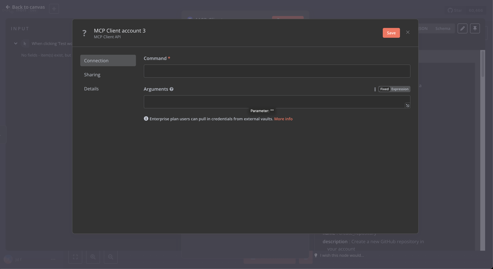
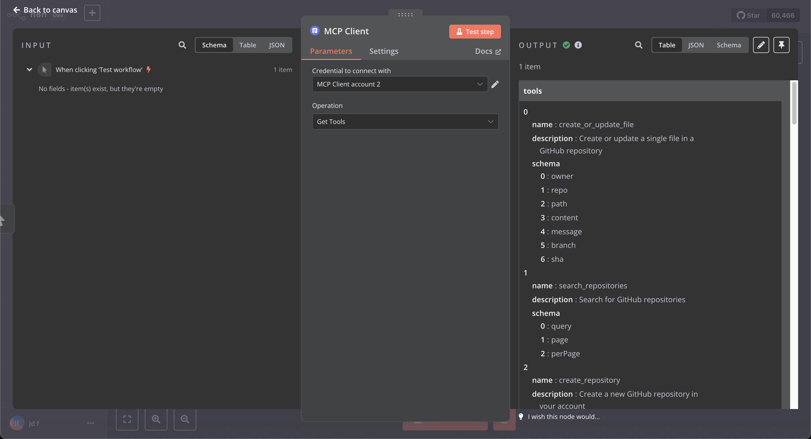

# n8n-nodes-mcp-client

This is an n8n community node that lets you interact with Model Context Protocol (MCP) servers in your n8n workflows.

MCP is a protocol that enables AI models to interact with external tools and data sources in a standardized way. This node allows you to connect to MCP servers, access resources, execute tools, and use prompts.

[n8n](https://n8n.io/) is a [fair-code licensed](https://docs.n8n.io/reference/license/) workflow automation platform.

[Installation](#installation)  
[Credentials](#credentials)  
[Operations](#operations)  
[Using as a Tool](#using-as-a-tool)  
[Compatibility](#compatibility)  
[Resources](#resources)  

## Installation

Follow the [installation guide](https://docs.n8n.io/integrations/community-nodes/installation/) in the n8n community nodes documentation.

## Credentials

The MCP Client node requires credentials to connect to an MCP server:



- **Command**: The command to start the MCP server
- **Arguments**: Optional arguments to pass to the server command

## Operations

The MCP Client node supports the following operations:


- **Execute Tool** - Execute a specific tool with parameters
- **Get Prompt** - Get a specific prompt template
- **List Prompts** - Get a list of available prompts
- **List Resources** - Get a list of available resources from the MCP server
- **List Tools** - Get a list of available tools
- **Read Resource** - Read a specific resource by URI

### Example: List Tools Operation



The List Tools operation returns all available tools from the MCP server, including their names, descriptions, and parameter schemas.

### Example: Execute Tool Operation


The Execute Tool operation allows you to execute a specific tool with parameters. Make sure to select the tool you want to execute from the dropdown menu.

## Using as a Tool

This node can be used as a tool in n8n AI Agents. To enable community nodes as tools, you need to set the `N8N_COMMUNITY_PACKAGES_ALLOW_TOOL_USAGE` environment variable to `true`.

### Setting the Environment Variable

**If you're using a bash/zsh shell:**
```bash
export N8N_COMMUNITY_PACKAGES_ALLOW_TOOL_USAGE=true
n8n start
```

**If you're using Docker:**
Add to your docker-compose.yml file:
```yaml
environment:
  - N8N_COMMUNITY_PACKAGES_ALLOW_TOOL_USAGE=true
```

**If you're using the desktop app:**
Create a `.env` file in the n8n directory:
```
N8N_COMMUNITY_PACKAGES_ALLOW_TOOL_USAGE=true
```

**If you want to set it permanently on Mac/Linux:**
Add to your `~/.zshrc` or `~/.bash_profile`:
```bash
export N8N_COMMUNITY_PACKAGES_ALLOW_TOOL_USAGE=true
```

Example of an AI Agent workflow results:


After setting this environment variable and restarting n8n, your MCP Client node will be available as a tool in AI Agent nodes.

## Compatibility

- Requires n8n version 1.0.0 or later
- Compatible with MCP Protocol version 1.0.0 or later

## Resources

* [n8n community nodes documentation](https://docs.n8n.io/integrations/community-nodes/)
* [Model Context Protocol Documentation](https://github.com/modelcontextprotocol/typescript-sdk)
* [MCP TypeScript SDK](https://github.com/modelcontextprotocol/typescript-sdk)


