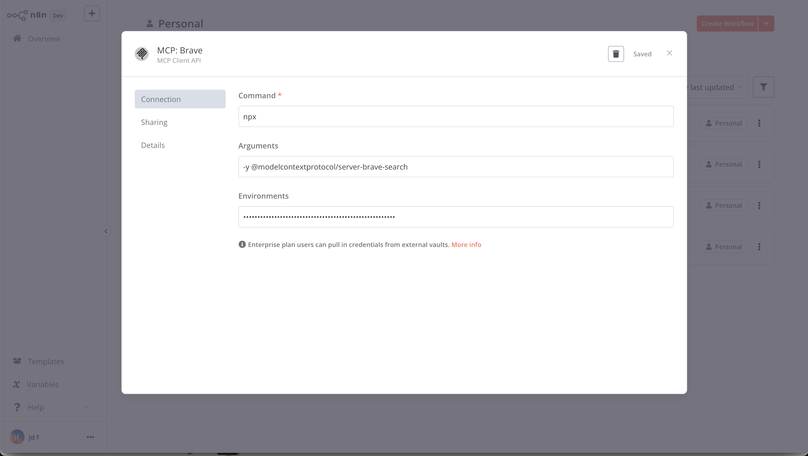
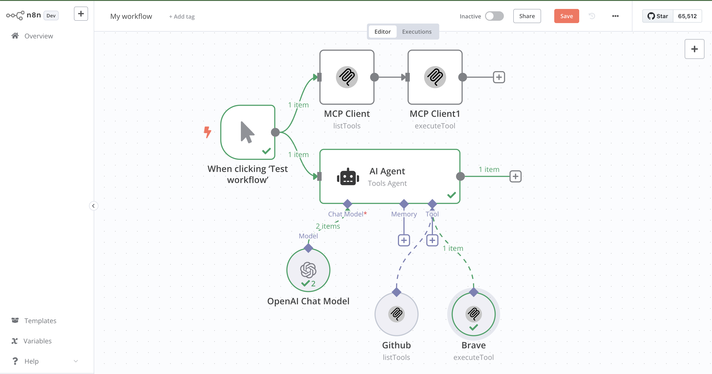
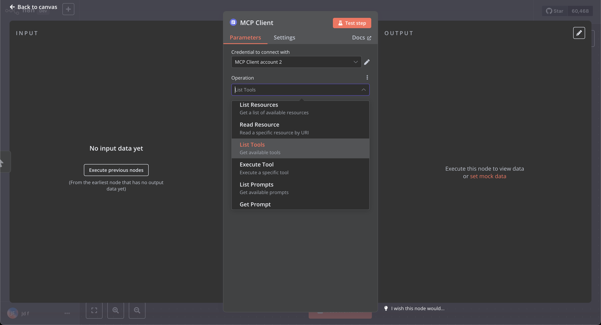
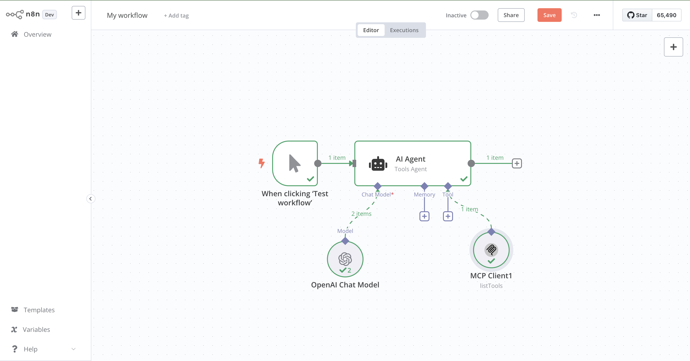
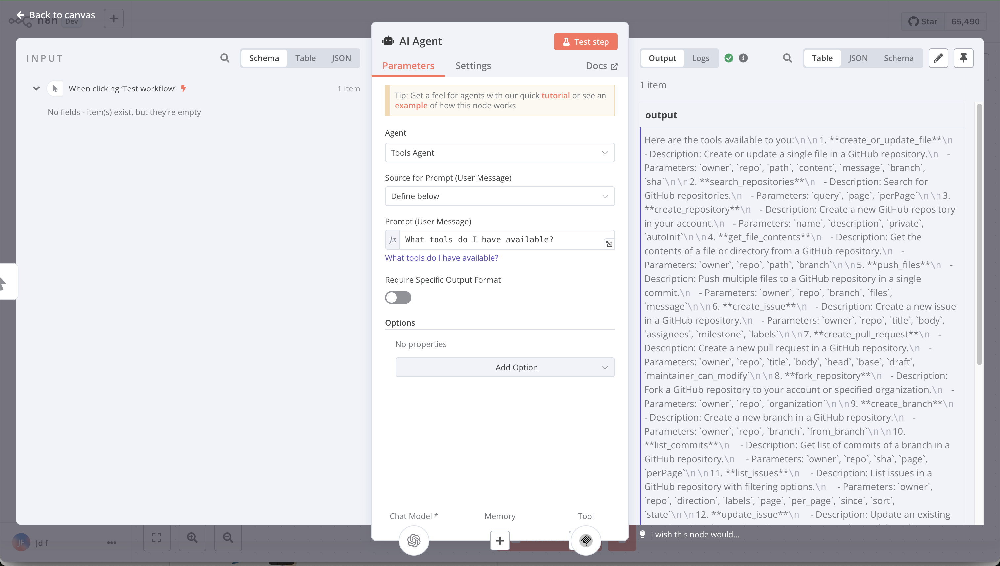

# n8n-nodes-mcp-client

This is an n8n community node that lets you interact with Model Context Protocol (MCP) servers in your n8n workflows.

MCP is a protocol that enables AI models to interact with external tools and data sources in a standardized way. This node allows you to connect to MCP servers, access resources, execute tools, and use prompts.

[n8n](https://n8n.io/) is a [fair-code licensed](https://docs.n8n.io/reference/license/) workflow automation platform.

[Installation](#installation)  
[Credentials](#credentials)  
[Environment Variables](#environment-variables)  
[Operations](#operations)  
[Using as a Tool](#using-as-a-tool)  
[Compatibility](#compatibility)  
[Resources](#resources)  

## Installation

Follow the [installation guide](https://docs.n8n.io/integrations/community-nodes/installation/) in the n8n community nodes documentation.

## Credentials

The MCP Client node requires credentials to connect to an MCP server:


- **Command**: The command to start the MCP server
- **Arguments**: Optional arguments to pass to the server command

## Environment Variables

The MCP Client node supports passing environment variables to the MCP server in two ways:

### 1. Using the Credentials UI

You can add environment variables directly in the credentials configuration:



This method is useful for individual setups and testing. The values are stored securely as credentials in n8n.

### 2. Using Docker Environment Variables

For Docker deployments, you can pass environment variables directly to your MCP servers by prefixing them with `MCP_`:

```yaml
version: '3'

services:
  n8n:
    image: n8nio/n8n
    environment:
      - MCP_BRAVE_API_KEY=your-api-key-here
      - MCP_OPENAI_API_KEY=your-openai-key-here
      - MCP_CUSTOM_SETTING=some-value
    # other configuration...
```

These environment variables will be automatically passed to your MCP servers when they are executed.

### Example: Using Brave Search MCP Server

This example shows how to set up and use the Brave Search MCP server:

1. Install the Brave Search MCP server:
   ```bash
   npm install -g @modelcontextprotocol/server-brave-search
   ```

2. Configure MCP Client credentials:
   - **Command**: `npx`
   - **Arguments**: `-y @modelcontextprotocol/server-brave-search`
   - **Environment Variables**: `BRAVE_API_KEY=your-api-key` Add a variables (space comma or newline separated)

3. Create a workflow that uses the MCP Client node:
   - Add an MCP Client node
   - Select the "List Tools" operation to see available search tools
   - Add another MCP Client node
   - Select the "Execute Tool" operation
   - Choose the "brave_search" tool
   - Set Parameters to: `{"query": "latest AI news"}`



The node will execute the search and return the results in the output.

### Example: Multi-Server Setup with AI Agent

This example demonstrates how to set up multiple MCP servers in a production environment and use them with an AI agent:

1. Configure your docker-compose.yml file:

```yaml
version: '3'

services:
  n8n:
    image: n8nio/n8n
    environment:
      # MCP server environment variables
      - MCP_BRAVE_API_KEY=your-brave-api-key
      - MCP_OPENAI_API_KEY=your-openai-key
      - MCP_SERPER_API_KEY=your-serper-key
      - MCP_WEATHER_API_KEY=your-weather-api-key
      
      # Enable community nodes as tools
      - N8N_COMMUNITY_PACKAGES_ALLOW_TOOL_USAGE=true
    ports:
      - "5678:5678"
    volumes:
      - ~/.n8n:/home/node/.n8n
```

2. Create multiple MCP Client credentials in n8n:

   **Brave Search Credentials**:
   - Command: `npx`
   - Arguments: `-y @modelcontextprotocol/server-brave-search`

   **OpenAI Tools Credentials**:
   - Command: `npx`
   - Arguments: `-y @modelcontextprotocol/server-openai`

   **Web Search Credentials**:
   - Command: `npx`
   - Arguments: `-y @modelcontextprotocol/server-serper`

   **Weather API Credentials**:
   - Command: `npx`
   - Arguments: `-y @modelcontextprotocol/server-weather`

3. Create an AI Agent workflow:
   - Add an AI Agent node
   - Enable MCP Client as a tool
   - Configure different MCP Client nodes with different credentials
   - Create a prompt that uses multiple data sources


Example AI Agent prompt:
```
I need you to help me plan a trip. First, search for popular destinations in {destination_country}.
Then, check the current weather in the top 3 cities.
Finally, find some recent news about travel restrictions for these places.
```

With this setup, the AI agent can use multiple MCP tools across different servers, all using environment variables configured in your Docker deployment.

## Operations

The MCP Client node supports the following operations:



- **Execute Tool** - Execute a specific tool with parameters
- **Get Prompt** - Get a specific prompt template
- **List Prompts** - Get a list of available prompts
- **List Resources** - Get a list of available resources from the MCP server
- **List Tools** - Get a list of available tools
- **Read Resource** - Read a specific resource by URI

### Example: List Tools Operation


The List Tools operation returns all available tools from the MCP server, including their names, descriptions, and parameter schemas.

### Example: Execute Tool Operation



The Execute Tool operation allows you to execute a specific tool with parameters. Make sure to select the tool you want to execute from the dropdown menu.

## Using as a Tool

This node can be used as a tool in n8n AI Agents. To enable community nodes as tools, you need to set the `N8N_COMMUNITY_PACKAGES_ALLOW_TOOL_USAGE` environment variable to `true`.

### Setting the Environment Variable

**If you're using a bash/zsh shell:**
```bash
export N8N_COMMUNITY_PACKAGES_ALLOW_TOOL_USAGE=true
n8n start
```

**If you're using Docker:**
Add to your docker-compose.yml file:
```yaml
environment:
  - N8N_COMMUNITY_PACKAGES_ALLOW_TOOL_USAGE=true
```

**If you're using the desktop app:**
Create a `.env` file in the n8n directory:
```
N8N_COMMUNITY_PACKAGES_ALLOW_TOOL_USAGE=true
```

**If you want to set it permanently on Mac/Linux:**
Add to your `~/.zshrc` or `~/.bash_profile`:
```bash
export N8N_COMMUNITY_PACKAGES_ALLOW_TOOL_USAGE=true
```

Example of an AI Agent workflow results:



After setting this environment variable and restarting n8n, your MCP Client node will be available as a tool in AI Agent nodes.

## Compatibility

- Requires n8n version 1.0.0 or later
- Compatible with MCP Protocol version 1.0.0 or later

## Resources

* [n8n community nodes documentation](https://docs.n8n.io/integrations/community-nodes/)
* [Model Context Protocol Documentation](https://github.com/modelcontextprotocol/typescript-sdk)
* [MCP TypeScript SDK](https://github.com/modelcontextprotocol/typescript-sdk)

## Note for Development

The README references several image assets that should be created:
- `assets/env-variables.png` - Screenshot of the environment variables UI in credentials
- `assets/brave-search-example.png` - Screenshot of a workflow using Brave Search
- `assets/multi-server-example.png` - Screenshot of a workflow using multiple MCP servers

Please create these screenshots to complete the documentation.


